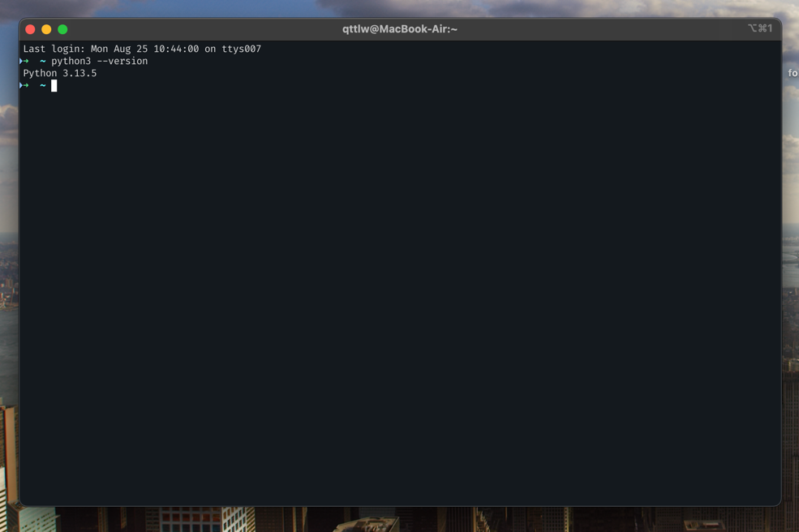
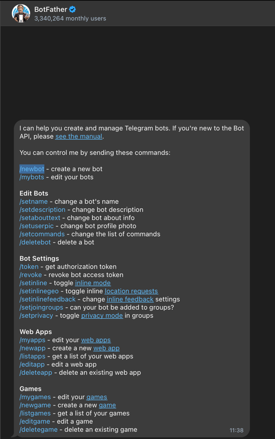
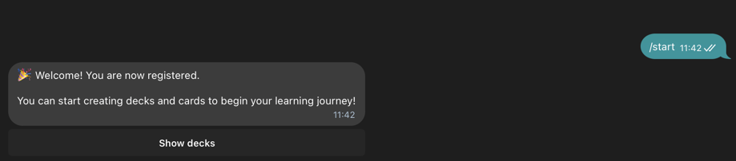

# 🎯 Clear Cards Bot

A powerful asynchronous telegram bot for creating and managing flashcards to enhance your learning process. Built with Python and aiogram, this bot helps people organize study materials into decks and flashcards (https://en.wikipedia.org/wiki/Flashcard>) and review them systematically.
## ✨ Features

- **📚 Separate data into decks**: Different materials and topics can be stored in different decks.
- **🃏 Card Creation**: To create a flashcard you just need to add text into its front and back.
- **🧠 Smart reviews**: Every click on "easy/good/bad/fail" button affects the time that you will likely see the card again.
- **📱 User-friendly Interface**: User-friendly Telegram interface which keeps a chat history clean.
- **🔒 Data storing**: Every account's data is stored differently.
- **💾 Database for everyone**: SQLite database which has all of the information.
- **⚡ High quality performance**: Built with asyncio for optimal performance. Many users can use this bot at one time.

## 🚀 Quick Start.

### What is needed?

- Python 3.11 or higher  
- 
- Telegram Bot Token (get it from [@BotFather](https://t.me/botfather))
- 
- Poetry (for dependency management)

### How to install? 

1. **Clone the repository**
   ```bash
   git clone <your-repo-url> 
   cd clear-cards-bot
   ```

2. **Install poetry dependencies**
   ```bash
   poetry install
   ```

3. **Activate your virtual environment**
   ```bash
   cp .env.example .env
   echo "api=YOUR_BOT_TOKEN_HERE" > .env
   ```

4. **Execute the bot**
   ```bash
   poetry run python -m src
   ```

## 📖 How to use? 

### Getting Started

1. Open Telegram, find your bot and begin a conversation.
2. Type `/start` to execute the bot and get your main menu.
- 
3. Use main menu for native navigation.

### What is this bot capable of?

#### 🆕 Creating decks
- Click "Create a deck" inline button to create a deck. 
- Type the name of your deck.
- Your deck is now ready for adding cards, use it as a tool for storing data (e.g Physics, English, Math, Biology).

#### 🃏 Adding flashcards
- Select a deck from your deck list after clicking "Show decks".
- Tap "Create a new card"
- Enter the front (which would be seen initially during the review) and back (usually, it is a translation, a formula, or a definition)
- Your card is not added into a certain deck

#### 📚 Reviewing flashcards
- Select a deck flashcards in which you want to review.
- Choose how many cards you want to review in case your cards are not enought, all of them will be reviewed (e.g 12 cards and reviewing 25 of them).
- Rate each card based on difficulty:
  - **Easy** (+5 memory points)
  - **Good** (+3 memory points)
  - **Hard** (+1 memory point)
  - **Fail** (-5 memory points)

#### 🗂️ Managing Content (essential when learning different stuff)
- View all your decks and cards
- Edit existing cards
- Delete decks and their associated cards
- Navigate back to main menu at any time

## 🔧 Configuration

### Environment Variables

- `api` - Your Telegram bot token (required)

### Database

The bot automatically creates and manages SQLite databases in the `databases/` directory:
- `app.db` - Production database
- `testing_app.db` - Testing database

### Database Schema

- **users**: Stores user registration information
- **decks**: Contains deck names and user associations
- **cards**: Stores flashcard content with memory tracking

## 🧪 Testing

The project includes comprehensive testing which ensures that everything works correctly:

```bash
# Run all tests
poetry run pytest

# Run specific test categories
poetry run pytest tests/unit/
poetry run pytest tests/integration/

# Run with coverage
poetry run pytest --cov=src
```

### Test Structure

- **Unit Tests**: Test individual functions and components
- **Integration Tests**: Test complete workflows and user interactions
- **Testing Database**: Separate testing database to avoid affecting production data

## 🛠️ Development

### Formatting

The project uses Black for code formatting:

```bash
poetry run black <your folders of files name>
```

### Deleop new features

1. Create a new module in `src/bot/`
2. Implement your functionality
3. Add the router to `src/__main__.py`
4. Write tests for your feature
5. That's it!

### Dependencies

- **aiogram**: Telegram Bot API framework
- **aiosqlite**: Async SQLite database driver
- **python-dotenv**: Environment variable management
- **pytest**: Testing framework
- **pytest-asyncio**: Async testing support

## 📱 Bot Commands

- `/start` - Initialize the bot and register the user

## 🤝 Contributing

1. Fork the repository
2. Create a feature branch
3. Make your changes
4. Add tests for new functionality
5. Ensure all tests pass
6. Send your request

## 📄 License

This project is licensed under the MIT License - see the [LICENSE](LICENSE) file for details.

## 👨‍💻 Author

**Timur Tamoev** - 16 years old student of Lyceum 239 in Saint-Petersburg, Russia.  

## 🆘 Support

If you encounter any issues or have questions:

1. Check the existing issues in the repository
2. Create a new issue with detailed information
3. Include your Python version and error messages

## 🚀 Future Enhancements

- [ ] Export/import functionality for decks
- [ ] Statistics and progress tracking
- [ ] Multiple language support
- [ ] Advanced spaced repetition algorithms
- [ ] Cloud synchronization
- [ ] Study reminders and scheduling

---

**Good luck with your learning! 🎓✨**
